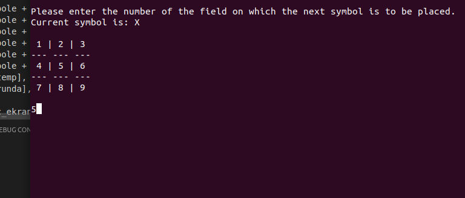

# Tic Tac Toe
Written on 5 Jan 2018.

Classic Tic Tac Toe game written entirely in Assembly (using external printf and scanf).

64 bit registers, using Linux terminal command to clear screen.

Can be compiled using NASM and GCC with these commands:

> nasm -f elf64 xo.asm

> gcc xo.o -o xo

then run using:

> ./xo
 

  

